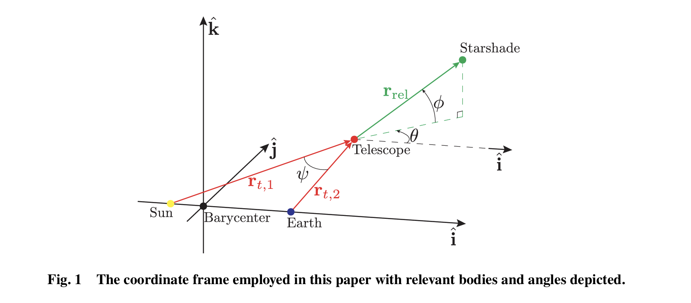

# Starshade Station Keeping

This project focuses on the concept of **station keeping** for a starshade spacecraft. Station keeping refers to the process of maintaining a spacecraft's position and orientation relative to a target, such as a telescope, to ensure precise alignment for scientific observations.

The computations and simulations in this project replicate the methodology described in the paper *Minimal Differential Lateral Acceleration Configurations for Starshade Stationkeeping in Exoplanet Direct Imaging* by Jackson Kulik ([arXiv:2105.05898](https://arxiv.org/abs/2105.05898)). This paper provides a detailed analysis of station keeping strategies and serves as a reference for the implemented algorithms.

## Overview of Scripts

1. **Script 1: Orbital Dynamics Simulation**  
This script models the orbital dynamics of the starshade and calculates the required adjustments to maintain its position relative to the telescope. The simulation incorporates gravitational forces, orbital perturbations, and control maneuvers based on the equations of motion derived from Newton's law of gravitation and the two-body problem.

Specifically, the simulation solves the following equations numerically:

1. **Gravitational Force**:  
The gravitational force acting on the starshade is modeled using Newton's law of gravitation:  
**F = G * (m1 * m2) / r²**,  
where:
- `F` is the gravitational force,
- `G` is the gravitational constant,
- `m1` and `m2` are the masses of the starshade and the central body (e.g., Earth or Sun),
- `r` is the distance between their centers of mass.

2. **Orbital Perturbations**:  
Perturbations due to non-spherical Earth effects (e.g., J2 perturbation) and third-body interactions are included. The J2 perturbation is modeled using:  
**Δa = -3/2 * J2 * (R² / r⁴) * (1 - 3 * sin²(φ))**,  
where:
- `J2` is the Earth's oblateness coefficient,
- `R` is the Earth's radius,
- `r` is the orbital radius,
- `φ` is the latitude of the starshade.

3. **Control Maneuvers**:  
The control maneuvers are calculated using proportional-derivative (PD) control to maintain the starshade's position relative to the telescope. The control force is given by:  
**F_control = k_p * e + k_d * de/dt**,  
where:
- `k_p` and `k_d` are the proportional and derivative gains,
- `e` is the positional error,
- `de/dt` is the rate of change of the positional error.

These equations are solved using numerical integration techniques, such as the Runge-Kutta method, to simulate the starshade's trajectory and the required adjustments.

The implementation is based on the methodologies described in the paper by Jackson Kulik, which provides a detailed analysis of starshade dynamics and control strategies. Key insights from the paper include the derivation of the control law and the incorporation of perturbation effects for high-fidelity simulations.

2. **Script 2: Control Algorithm**

This script implements a control algorithm to execute station keeping maneuvers. It computes the necessary thruster firings or adjustments to correct deviations and maintain alignment with the telescope.

The control algorithm is based on the proportional-derivative (PD) control law, which is expressed mathematically as:

**F_control = k_p * e + k_d * de/dt**,  
where:
- `F_control` is the control force applied by the thrusters,
- `k_p` is the proportional gain, which determines the response to positional error,
- `k_d` is the derivative gain, which determines the response to the rate of change of positional error,
- `e` is the positional error (difference between the desired and actual position),
- `de/dt` is the rate of change of the positional error.

The algorithm continuously monitors the starshade's position and computes the required adjustments to minimize the positional error. The thruster firings are optimized to ensure precise alignment with the telescope while minimizing fuel consumption.

This implementation follows the methodology outlined in Jackson Kulik's paper, which emphasizes the importance of efficient control strategies for station keeping in exoplanet direct imaging missions.

## Specific Achievements of This Project
- Accurate simulation of orbital dynamics for station keeping scenarios.
- Implementation of an efficient control algorithm to minimize fuel usage while maintaining precise alignment.

This project provides a foundation for understanding and solving station keeping challenges in space missions involving starshades. Thanks to Prof. Dmitry Savransky, Prof. Jackson Kulik, Dr. Grace Genszler at the Cornell Space Imaging and Optical Systems Lab for navigating me through the project. 